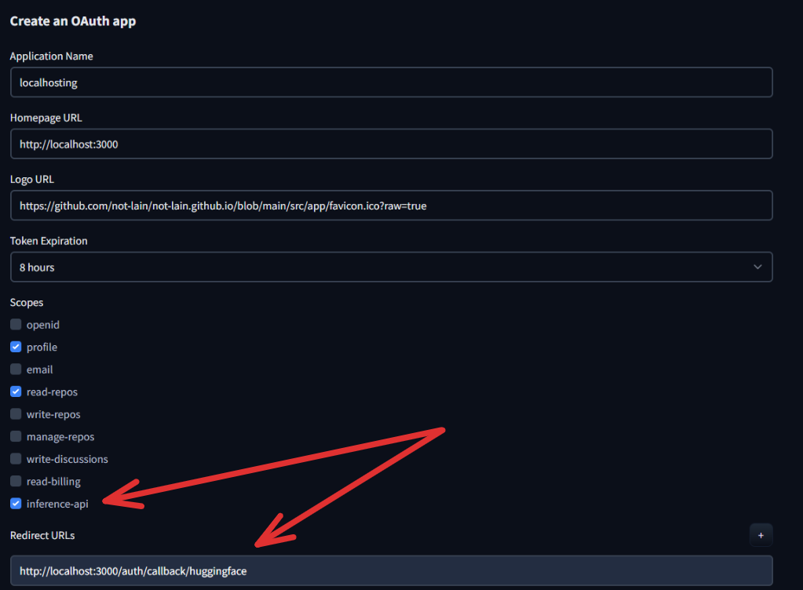
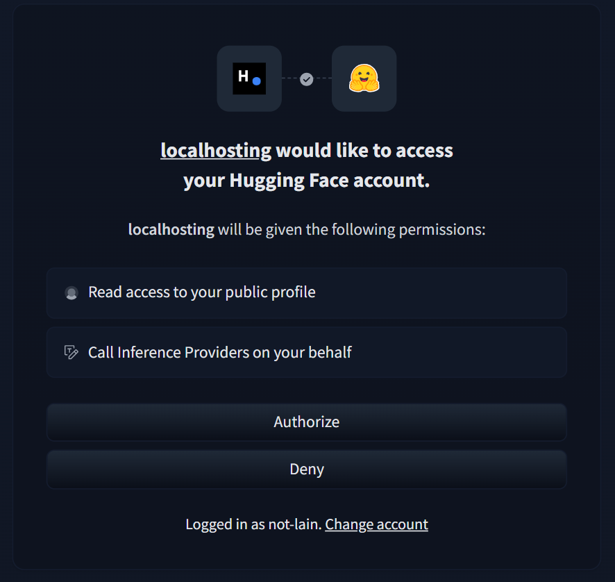
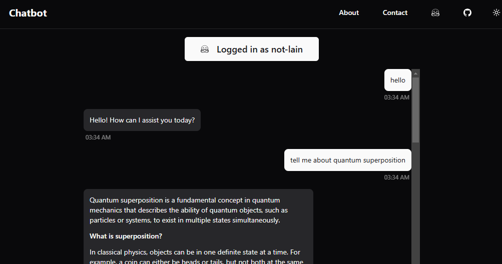

# Chatbot

## Getting Started
1. create  [new huggingface application](https://huggingface.co/settings/applications/new)



2. copy `.example.env.local` to `.env.local` and fill all the necessary info from your [application info](https://huggingface.co/settings/connected-applications) (ps you can find your application at the end of the page)


3. install the necessary dependencies 
```bash
pnpm i
```

4. run the development server:
```bash
pnpm dev
```

5. click on the login button and authorise the HF login




6. enjoy

